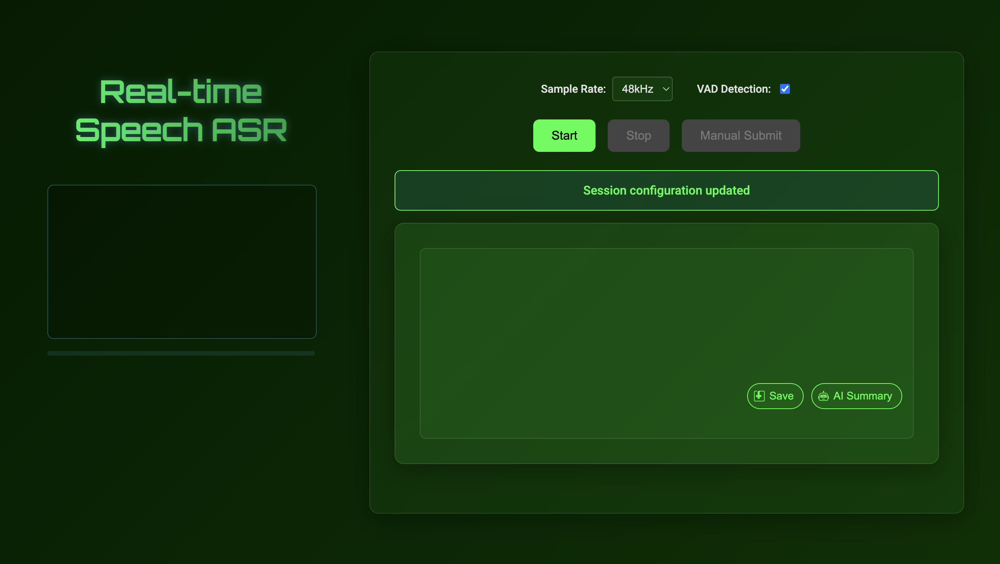

# StreamASR - 实时语音识别服务

<div align="center">


**🎯 基于 OpenAI Realtime API 兼容的实时语音识别服务**

[](https://github.com/go-restream/stt)

**🌐 语言:** [English](README.md) | [中文](README-zh.md)

</div>

## 📋 项目概述

**StreamASR** 是一个高性能的实时语音识别服务，提供 WebSocket 接口支持音频流的实时转录(OpenAI标准 v1/audio/transcriptions接口转化为实时语音识别服务)。项目集成了 VAD（语音活动检测）和多种 ASR 引擎，支持灵活的配置和部署。

### ✨ 核心特性

- **🎤 实时语音识别** - 基于 WebSocket 的低延迟音频流处理
- **🧠 智能 VAD 检测** - 集成 Sherpa-ONNX 语音活动检测，自动触发音频提交
- **🔄 OpenAI 兼容** - 支持 OpenAI 兼容的 ASR 接口，可配置多种模型
- **📊 结构化日志** - 基于 logrus 的详细日志记录和监控
- **🐳 Docker 支持** - 完整的容器化部署方案
- **🔧 版本管理** - 自动化版本管理和构建流程
- **🌐 多语言 SDK** - 提供 Go 和 TypeScript 客户端 SDK

## 🚀 快速开始

### 📋 前置要求

- **Go 1.23+** - 服务端运行环境
- **VAD 模型文件** - Sherpa-ONNX VAD 模型 (silero_vad.onnx)
- **ASR 服务** - OpenAI 兼容的语音识别 API

### ⚡ 快速启动

#### 方式 1: 使用 Makefile（推荐）

```bash
# 克隆项目
git clone https://github.com/go-restream/stt.git
cd stt

# 安装依赖并构建
make install
make build

# 启动服务
make run
```

#### 方式 2: 手动编译

```bash
# 安装依赖
go mod download

# 构建项目
go build -o streamASR main.go

# 启动服务
./streamASR -c config.yaml
```

#### 方式 3: Docker 部署

```bash
# 使用 docker-compose
make docker-deploy

# 或手动构建
make docker-build
make docker-compose-up
```

### 🎯 验证安装

服务启动后，可以通过以下方式验证：

```bash
# 查看版本信息
./build/streamASR -v

# 健康检查
curl http://localhost:8088/health

# 查看服务状态
curl http://localhost:8088/status
```

## 🌐 Web 界面

StreamASR 提供了一个内置的 Web UI 工具，方便用户通过浏览器直接进行实时语音识别测试。

### 📸 Web UI 预览



### 🎯 访问 Web UI

启动服务后，在浏览器中访问：

```bash
# 主界面
http://localhost:8088/

# 或者直接访问静态文件
http://localhost:8088/static/index.html
```

### ✨ Web UI 功能特性

- **🎤 实时音频可视化** - 动态显示音频波形和音量级别
- **🔧 配置选项** - 支持采样率选择（16kHz/48kHz）和 VAD 开关
- **⚡ 实时转录** - 实时显示语音识别结果
- **🎨 主题切换** - 支持多种视觉主题（深蓝科技、紫色赛博、绿色矩阵）
- **💾 结果保存** - 支持转录结果的复制和保存
- **🤖 AI 总结** - 集成 AI 功能对转录内容进行智能总结

### 🎮 使用步骤

1. **打开浏览器** 访问 `http://localhost:8088`
2. **配置参数** 选择采样率和 VAD 检测开关
3. **点击开始** 启动语音识别
4. **授权麦克风** 浏览器会请求麦克风权限
5. **开始说话** 实时查看转录结果
6. **保存结果** 使用保存按钮复制转录文本

### 🔧 技术特性

- **WebSocket 连接** - 基于 WebSocket 的低延迟通信
- **自动重连** - 支持断线自动重连机制
- **心跳检测** - 30秒心跳保持连接稳定
- **错误处理** - 完善的错误提示和状态显示

## 🔧 配置说明

### 服务配置文件 (config.yaml)

```yaml
# 服务端口配置
service_port: "8088"

# OpenAI兼容ASR接口配置
asr:
  base_url: "http://localhost:3000/v1"        # ASR接口基础URL
  api_key: "your-api-key"                    # ASR接口API密钥
  model: "FireRed-large"                     # ASR模型名称

# OpenAI兼容LLM接口配置（可选）
llm:
  base_url: "https://api.deepseek.com/v1"    # LLM接口基础URL
  api_key: "your-llm-api-key"                # LLM接口API密钥
  model: "deepseek-chat"

# 音频配置
audio:
  enable: true
  save_dir: "./audio"                        # 音频文件保存目录
  keep_files: 10                             # 保留最近多少wav文件记录
  sample_rate: 16000                         # 采样率 (16kHz/48kHz)
  channels: 1                                # 声道数
  bit_depth: 16                              # 位深度
  buffer_size: 10                            # 10秒缓冲区

# VAD配置
vad:
  enable: true
  model: "./model/silero_vad.onnx"          # VAD模型路径
  threshold: 0.5                             # 语音检测阈值
  min_silence_duration: 1                    # 最小静音持续时间(秒)
  min_speech_duration: 0.1                   # 最小语音持续时间(秒)
  window_size: 512                           # 窗口大小
  max_speech_duration: 8.0                   # 最大语音持续时间(秒)
  sample_rate: 16000                         # 采样率
  num_threads: 1                             # 线程数
  provider: "cpu"                            # 计算提供方

# 日志配置
logging:
  level: "info"                              # 日志级别
  file: ""                                   # 日志文件路径，留空则输出到stderr
  format: "json"                             # 日志格式: json, text
```

## 🐳 Docker 部署

### Docker Compose 部署

```bash
# 构建并启动服务
make docker-deploy

# 查看日志
make docker-compose-logs

# 停止服务
make docker-compose-down
```

### Dockerfile 特性

- **多阶段构建** - 优化镜像大小
- **版本信息注入** - 自动注入版本、构建时间等信息
- **健康检查** - 内置健康检查机制
- **非 root 用户** - 安全的容器运行环境

详细的 Docker 部署指南请参考：[docs/DOCKER.md](docs/DOCKER.md)

## 📋 命令行选项

```bash
# 显示版本信息
./streamASR -v
./streamASR --version

# 指定配置文件
./streamASR -c config.yaml

# 查看帮助信息
./streamASR -h
```

## 🧪 客户端 SDK

### Go SDK

```go
package main

import (
    "streamASR/sdk/golang/client"
)

func main() {
    // 创建客户端
    recognizer := client.NewRecognizer("ws://localhost:8088")

    // 连接并开始识别
    err := recognizer.Connect()
    if err != nil {
        panic(err)
    }
    defer recognizer.Close()

    // 处理音频...
}
```

### TypeScript SDK

```typescript
import { StreamASRClient } from '@streamasr/typescript-sdk';

const client = new StreamASRClient({
    url: 'ws://localhost:8088',
    autoConnect: true
});

// 监听转录结果
client.on('transcription', (result) => {
    console.log('识别结果:', result.text);
});
```

## 📊 监控和日志

### 结构化日志

服务使用 logrus 进行结构化日志记录：

```json
{
  "component": "mont_srv_status",
  "action": "health_check_status",
  "version": "v0.1.2-171f62c",
  "build_time": "2025-11-02T05:24:39Z",
  "git_commit": "171f62c",
  "level": "info",
  "msg": "✔ Starting StreamASR v0.1.2-171f62c with config: config.yaml"
}
```

### 健康检查

```bash
# 基础健康检查
curl http://localhost:8088/health

# 返回示例
{
  "status": "healthy",
  "version": "v0.1.2-171f62c",
  "uptime": "2h30m15s",
  "asr_engine": "available"
}
```


## 🔧 版本管理

项目采用语义化版本管理，支持自动化版本发布：

```bash
# 查看当前版本
make version

# 版本升级
make version-bump-patch    # v0.1.2 -> v0.1.3
make version-bump-minor    # v0.1.2 -> v0.2.0
make version-bump-major    # v0.1.2 -> v1.0.0

# 创建 Git 标签
make tag

# 构建 Docker 镜像
make docker-build          # 生成 streamasr:latest 和 streamasr:v0.1.2
```

详细的版本管理指南请参考：[docs/VERSION.md](docs/VERSION.md)

## 🛠️ 开发指南

### 开发环境设置

```bash
# 克隆项目
git clone https://github.com/go-restream/stt.git
cd stt

# 安装依赖
make install

# 运行测试
make test

# 构建
make build

# 运行
make run
```

### 开发模式

```bash
# Docker 开发模式
make docker-debug

# 查看日志
make docker-logs

# 进入容器调试
make docker-exec
```

### 测试

```bash
# 运行单元测试
make test

# 运行集成测试
go test ./...
```

## 🐛 故障排除

### 常见问题

1. **VAD 模型文件缺失**
   ```bash
   # 确保 VAD 模型文件存在
   ls -la vad/model/silero_vad.onnx
   ```

2. **ASR 服务连接失败**
   ```bash
   # 检查 ASR 服务配置
   curl -H "Authorization: Bearer $API_KEY" \
        -H "Content-Type: application/json" \
        -d '{"model":"FireRed-large","file":"..."}' \
        $ASR_BASE_URL/audio/transcriptions
   ```

3. **端口占用**
   ```bash
   # 检查端口占用
   lsof -i :8088

   # 修改配置文件中的端口
   vim config.yaml
   ```

### 调试模式

启用详细日志输出：

```bash
# 修改配置文件
vim config.yaml
# 设置 logging.level: "debug"

# 或设置环境变量
export LOG_LEVEL=debug
./streamASR
```

## 📊 性能指标

- **响应延迟**: < 500ms 端到端识别延迟
- **并发支持**: 支持多并发 WebSocket 连接
- **音频处理**: 支持 16kHz/48kHz 采样率
- **VAD 延迟**: < 100ms 语音活动检测延迟

## 🤝 贡献指南

我们欢迎社区贡献！请遵循以下步骤：

1. Fork 项目仓库
2. 创建功能分支 (`git checkout -b feature/amazing-feature`)
3. 提交更改 (`git commit -m 'Add amazing feature'`)
4. 推送到分支 (`git push origin feature/amazing-feature`)
5. 创建 Pull Request

### 开发规范

- 遵循 Go 代码规范
- 添加单元测试
- 更新相关文档
- 通过所有 CI 检查

## 📞 支持与帮助

### 📚 完整文档

- **[Docker 部署指南](docs/DOCKER.md)** - 完整的 Docker 部署说明
- **[版本管理文档](docs/VERSION.md)** - 版本管理规范和使用
- **[变更日志](docs/CHANGELOG.md)** - 详细的版本变更记录

### 🆘 获取帮助

| 方式 | 描述 | 响应时间 |
|------|------|----------|
| **GitHub Issues** | Bug 报告和功能请求 | 24-48小时 |
| **GitHub Discussions** | 技术讨论和问答 | 社区响应 |

---

## 🏷️ 版本更新记录

### v0.1.2 (2025-11-02)

#### ✨ 新增功能
- **🏷️ 版本管理系统** - 完整的版本管理和构建流程
- **🐳 Docker 支持** - 完整的容器化部署方案
- **📋 Makefile 集成** - 自动化构建和部署脚本
- **📖 文档完善** - 详细的部署和开发文档

#### 🔧 技术改进
- **🔧 项目结构优化** - 更清晰的代码组织和模块划分
- **📝 日志增强** - 启动日志包含版本信息
- **🛠️ 构建流程** - 支持版本信息自动注入

### v0.1.1

#### ✨ 新增功能
- **🎤 实时语音识别** - 基于 WebSocket 的音频流处理
- **🧠 VAD 集成** - Sherpa-ONNX 语音活动检测
- **🔄 ASR 接口** - OpenAI 兼容的语音识别 API
- **📊 健康检查** - 服务状态监控接口

---

## 🎯 总结

**StreamASR** 是一个功能完整、易于部署的实时语音识别服务。通过 Docker 容器化、版本管理系统和完善的文档，为生产环境提供了可靠的语音识别解决方案。

<div align="center">

**⭐ 如果这个项目对您有帮助，请给我们一个 Star！**

🎯 **StreamASR - 让语音识别变得简单而强大**

</div>